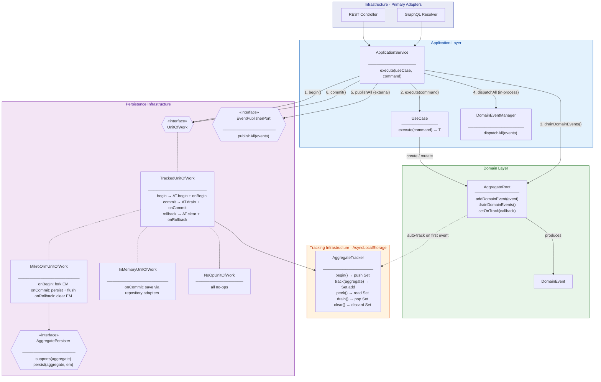

# DDD Template

DDD template with Hexagonal Architecture (Ports & Adapters) in TypeScript.

## Stack

- **TypeScript 5.9** with strict mode
- **Node.js 24** with native test runner (`node:test`)
- **SWC** on-the-fly transpilation (no build step)
- **ESM** modules
- **MikroORM** + **SQLite** for persistence

## Architecture

```
src/
├── shared/              # Shared kernel (base classes for all bounded contexts)
│   ├── domain/          # Identifier, ValueObject, Entity, AggregateRoot, DomainEvent
│   ├── application/     # UseCase, ApplicationService, DomainEventManager, UnitOfWork
│   ├── ports/           # RepositoryPort, EventPublisherPort, LoggerPort
│   └── infrastructure/
│       ├── logging/     # ConsoleLogger, LoggerRegistry, @log decorator
│       ├── events/      # EventEmitterEventBus
│       ├── http/        # HttpServer (GET/POST, route params)
│       ├── graphql/     # GraphqlServer
│       └── persistence/ # AggregateTracker, TrackedUnitOfWork, AggregatePersister
│           └── adapters/  # MikroOrmUnitOfWork, InMemoryUnitOfWork, NoOpUnitOfWork
│
├── modules/<context>/   # Bounded contexts (vertical slices)
│   ├── domain/          # Identifiers, ValueObjects, Entities, Aggregates, Events
│   ├── application/     # Commands, Queries, Ports (primary/secondary), UseCases
│   ├── infrastructure/  # Adapters (persistence, http, graphql, notifications)
│   └── bootstrap/       # <Context>Module.ts (wires deps, registers routes)
│
├── migrations/          # MikroORM migrations
├── mikro-orm.config.ts  # MikroORM configuration (SQLite)
├── main.ts              # Composition root (monolith entry point)
└── context/docs/        # Architecture Decision Records (ADRs)
```

Dependencies point inward: infrastructure -> application -> domain. Domain never imports from outer layers.

## Building Blocks

| Pattern | Description |
|---------|-------------|
| **Identifier** | UUID-based identity. Subclass for each domain ID (e.g. `UserId extends Identifier`) |
| **ValueObject\<Props\>** | Immutable via `Object.defineProperty`. Protected props with public getters. Equality by value |
| **Entity\<Id, Props\>** | Has identity + protected props with public getters. Equality by ID |
| **AggregateRoot\<Id, Props\>** | Extends Entity. Auto-tracks via `setOnTrack()` callback. Supports `reconstitute()` for persistence hydration |
| **DomainEvent** | Immutable fact that happened in the domain |
| **UseCase** | Returns `Promise<T>` directly — no wrapper types |
| **ApplicationService** | Orchestrates: begin -> execute -> drain events -> dispatch -> publish -> commit |
| **Command** | Private constructor + static `of()` factory receiving primitives |
| **TrackedUnitOfWork** | Abstract UoW with automatic aggregate tracking via `AsyncLocalStorage` |
| **AggregatePersister** | Per-module strategy to persist tracked aggregates on commit |

## Automatic Aggregate Tracking

Aggregates auto-register themselves for persistence and event draining. Use cases return `Promise<T>` directly — no need to manually track or return aggregates.



### How It Works

1. **Startup** — `AggregateRoot.setOnTrack(callback)` wires a global callback that calls `AggregateTracker.track(aggregate)`
2. **begin()** — `TrackedUnitOfWork` calls `AggregateTracker.begin()`, pushing a new `Set` onto a stack scoped to the current async context via `AsyncLocalStorage`
3. **Use case** — When `aggregate.addDomainEvent(event)` is called, the aggregate auto-registers itself in the current scope (once per drain cycle)
4. **Events** — `ApplicationService` peeks at tracked aggregates, drains their domain events, dispatches in-process and publishes externally
5. **commit()** — `TrackedUnitOfWork` drains the scope and passes the aggregates to `onCommit()`, where the concrete implementation (e.g. `MikroOrmUnitOfWork`) routes each to its `AggregatePersister` and flushes
6. **rollback()** — `AggregateTracker.clear()` discards the current scope; concrete implementation cleans up (e.g. clear EntityManager)
7. **Nested scopes** — Stack-based design supports nested `begin()`/`commit()` within the same async context


## Getting Started

```bash
npm install
npm run migration:up    # Create SQLite database and apply migrations
npm start               # Start REST (port 3000) + GraphQL (port 4000)
```

## Commands

```bash
npm test              # Run all tests (230 tests)
npm run test:watch    # Run tests in watch mode
npm run typecheck     # Type check (tsc, no emit)
npm start             # Start HTTP + GraphQL servers
npm run migration:create  # Create a new migration
npm run migration:up      # Apply pending migrations
npm run bench         # Run performance benchmarks
```

## API Endpoints

### REST

```
POST /users                     # Create a new user
GET  /users/:userId             # Get user by ID (with addresses)
POST /users/:userId/addresses   # Add address to user
```

### GraphQL

```graphql
mutation {
  createUser(input: { name: "John", email: "john@example.com" }) {
    id
    name
    email
  }
}
```

## Example: User Bounded Context

The template includes a complete `User` bounded context as reference:

```
src/modules/user/
├── domain/
│   ├── aggregates/     # User (AggregateRoot) with reconstitute()
│   ├── entities/       # Address (Entity with VOs)
│   ├── identifiers/    # UserId, AddressId
│   ├── valueObjects/   # Email, Street, AddressNumber, City, State, ZipCode
│   └── events/         # UserCreatedEvent, AddressAddedEvent
├── application/
│   ├── command/        # CreateUserCommand, AddAddressCommand, GetUserByIdQuery
│   ├── port/
│   │   ├── primary/    # CreateUserPort, AddAddressPort, GetUserByIdPort
│   │   └── secondary/  # UserRepositoryPort
│   └── usecase/        # CreateUserUseCase, AddAddressUseCase, GetUserByIdUseCase
├── infrastructure/
│   ├── http/           # CreateUserController, AddAddressController, GetUserController
│   ├── graphql/        # CreateUserResolver
│   ├── persistence/
│   │   ├── in-memory/  # InMemoryUserRepository (tests)
│   │   └── mikro-orm/  # ORM entities, schemas, mappers, repository, persister
│   └── notifications/  # ConsoleEmailNotification
├── bootstrap/          # UserModule (vertical slice wiring)
├── integrationTests/   # Full cycle integration tests
└── performanceTests/   # Benchmark tests
```

## Test Conventions

- Co-located: `Foo.ts` + `Foo.test.ts` side by side
- Integration tests in `<module>/integrationTests/`
- Performance benchmarks in `<module>/performanceTests/`
- Framework: `node:test` (`describe`/`it`) + `node:assert/strict`
- Use `InMemoryUnitOfWork` + `InMemoryRepositoryAdapter` in tests
- Set up `AggregateRoot.setOnTrack()` in `beforeEach`, reset in `afterEach`

## ADRs

Architecture Decision Records are in `src/context/docs/`:

- [001 - Native Type Stripping](src/context/docs/001-native-type-stripping.md)
- [002 - TC39 Decorators](src/context/docs/002-tc39-decorators.md)
- [003 - Domain Event Dispatch](src/context/docs/003-domain-event-dispatch.md)
- [004 - Unit of Work Pattern](src/context/docs/004-unit-of-work-pattern.md)
- [005 - Application Service Orchestration](src/context/docs/005-application-service-orchestration.md)

## License

ISC
